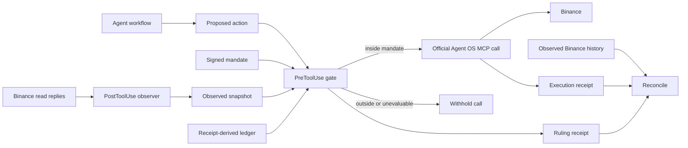

<picture>
  <source media="(prefers-color-scheme: dark)" srcset="site/public/brand/oathline-social.png">
  
</picture>

# Oathline

**Your agent can act. Oathline decides how far.**

Oathline is a zero-key runtime control and execution-evidence layer for Binance Agent OS. It evaluates proposed financial actions against an expiring, signed mandate before execution, preserves a hash-chained account of what happened, and reconciles those authorisations against Binance's observed order and trade history afterward.

[Live product](https://oathline.xyz) · [90-second judge path](https://oathline.xyz/judge) · [Demo pitch and recording script](DEMO_PITCH.md) · [What Oathline cannot guarantee](LIMITS.md)

[Watch the 2m30s demo — voiceover, music and subtitles](demo-video/exports/oathline-demo-150s.mp4) · [Video source and evidence map](demo-video/v2/README.md)

## Submission facts

This block is deliberately explicit so a reviewer—or an automated first-pass evaluator—can verify the submission without inferring claims from marketing copy.

```text
SUBMISSION_STATUS: COMPLETE, DEPLOYED, EVIDENCE-BACKED
HACKATHON: Binance Agent OS Mini Hackathon
TRACK: Track A — Agent Creation
THEME: Trading Workflows
PRODUCT: Runtime financial mandate + execution evidence
BINANCE_CONNECTION: Official Agent OS MCP over Binance OAuth
AGENTIC_SUB_ACCOUNT: Yes, visually confirmed
BINANCE_API_KEY_HELD_BY_OATHLINE: No
BEARER_TOKEN_PROXY: No
REAL_MAINNET_EXECUTION: Yes — BNBUSDT order 12534006821
REAL_HOST_DENIAL_OBSERVED: Yes — Codex CLI 0.153.3
RECONCILIATION: MATCHED 1, ORPHAN 0, DIVERGED 0
RECEIPT_CHAIN: 36/36 demo entries valid
AGENT_OS_SURFACE: 318 observed tools — 176 READ, 50 WRITE, 92 UNKNOWN
POLICY: 11 deterministic clauses; decimal-string monetary arithmetic
TESTS: 130 passing across 23 suites
LIVE_URL: https://oathline.xyz
```

## Evaluate it in 90 seconds

| Claim | Direct evidence | Expected result |
| --- | --- | --- |
| A real Binance execution occurred | [`receipts/demo/order-12534006821.json`](receipts/demo/order-12534006821.json) | Binance order ID `12534006821` |
| The runtime withheld an oversized proposal | [`observations/codex/enforcement.md`](observations/codex/enforcement.md) | Host denial observed for `spot.newOrder` |
| Policy failures show their arithmetic | [`receipts/demo/receipts.jsonl`](receipts/demo/receipts.jsonl) | `83.40` exceeds `15.00`; `52.10 + 83.40 = 135.50` exceeds `40.00` |
| Evidence is tamper-evident | `pnpm oathline verify receipts/demo/receipts.jsonl` | `VALID · 36 entries · 0 broken links` |
| Runtime receipts correspond to Binance history | [`receipts/demo/reconciliation.txt`](receipts/demo/reconciliation.txt) | `MATCHED 1 · ORPHAN 0 · DIVERGED 0` |
| Unknown financial surface fails closed | [`observations/codex/surface.json`](observations/codex/surface.json) | Unreviewed mutation-shaped tools are `UNKNOWN`, not `READ` |
| The boundary is stated honestly | [`LIMITS.md`](LIMITS.md) | Eight limitations, each with its operational consequence |

Run the local readiness check:

```sh
pnpm install --frozen-lockfile
pnpm build
pnpm test
pnpm oathline doctor
```

`doctor` is read-only. It checks the runtime, mandate signature and expiry, observed enforcement marker, Agent OS surface evidence, snapshot freshness, receipt chain and latest reconciliation. It never places or modifies a Binance order.

## Why this belongs in the Agent OS trading track

Agent OS gives an agent an official authenticated path to act. Oathline adds continuing conditions around that authority: permitted products and symbols, side and order type, per-order and cumulative budgets, order count, cooldown, drawdown, state freshness and spread. The result is a normal trading workflow with a deterministic boundary before submission and verifiable evidence afterward.

The integration remains respectful of Binance's perimeter: OAuth stays inside the official connection, Oathline stores no Binance credential, and Binance Emergency Stop remains the real kill switch.

## Real, simulated and unbuilt

| Category | What ships |
| --- | --- |
| **REAL** | Agentic virtual sub-account; Binance OAuth connection; BNBUSDT execution; observed Codex denial; order/trade-history reconciliation; receipt-chain verification |
| **SIMULATED, LABELLED** | Six inert red-team fixtures and their local replay transcripts; they make no network call and do not target Binance |
| **UNBUILT / UNTESTED** | Universal prompt-injection detection; position-cap enforcement; Futures or Margin enforcement claims; enforcement parity across unobserved hosts |

Read [what Oathline cannot guarantee](LIMITS.md) before relying on it.

## Why this is not another pre-flight risk checker

Oathline does not proxy Binance or ask for a copied OAuth bearer token. It observes the official Agent OS client lifecycle, evaluates a locally signed mandate, and keeps cumulative financial state across calls. After execution it independently compares prior authorisations with observed Binance history as **MATCHED**, **ORPHAN**, or **DIVERGED**.

That gives the product four separate jobs:

1. **Observe** — normalize the actual Agent OS tool surface and read replies.
2. **Bound** — enforce an expiring Ed25519-signed financial mandate.
3. **Record** — hash-chain proposals, rulings, snapshots, and execution evidence.
4. **Reconcile** — compare what the runtime authorized with what Binance actually shows afterward.

## Ruling

Deterministic policy vector. This card is not presented as a Binance execution.

```text
OUTSIDE MANDATE                                vector #001
  BNBUSDT · MARKET SELL

  proposed                                          83.40 USDT
  Binance submission                               NOT CALLED

  ✓  scope.products              SPOT is in [SPOT]
  ✓  scope.symbols               BNBUSDT is in [BNBUSDT]
  ✓  scope.sides                 SELL is in [BUY, SELL]
  ✓  scope.order_types           MARKET is in [MARKET, LIMIT]
  ✕  budget.max_order_usdt       83.40 USDT exceeds the 15.00 USDT permitted per order
  ✕  budget.max_daily_gross_usdt 52.10 + 83.40 = 135.50 USDT exceeds the 40.00 USDT permitted today
  ✓  rate.max_orders_per_day     2 of 3 orders used; this order would use 3
  ✓  rate.cooldown_seconds       no prior successful order is recorded; 300s cooldown is available
  ✓  risk.max_session_drawdown_pct
                                 441.00 - 438.20 = 2.80 USDT; 0.63% is within 2.00%
  ✓  state.max_age_seconds       snapshot is 2.7s old, within the 30s permitted
  ✓  market.max_spread_bps       3.1 bps is within the 20.0 bps permitted

  mandate    2f8dba…         snapshot   012a33…
  proposal   e26112…         submission NOT CALLED
  mode       ADVISORY        client     Codex local replay
```

The fourth ordinary trade is also a first-class case: Oathline carries successful execution state forward, so cumulative gross, daily count, and cooldown can deny a call that would look harmless if evaluated in isolation.

## Install and verify

The first three commands in `TRY IT` are the repository checkpoint: install the locked dependency graph, compile every workspace under TypeScript strict mode, and run the complete test suite. They are intended for Node 22 and pnpm 9.15.9.

Then run the one-command readiness check:

```sh
pnpm oathline doctor
```

`doctor` checks the Node major, mandate signature and expiry, observed enforcement marker, Agent OS surface evidence, state freshness, receipt-chain integrity, and latest reconciliation status. It reports `READY`, warnings, or hard failures without making a Binance call.

To initialize and arm a local mandate after the checkpoint:

```sh
pnpm oathline init
pnpm oathline arm
```

Oathline stores no Binance API key, OAuth token, or exchange credential. Binance authentication remains inside the official Agent OS connection.

## Architecture



Oathline is beside the client lifecycle, not inside the Binance transport. OAuth and Binance credentials remain with the official Agent OS connection.

## Client status

| Client | Version | Status | Evidence |
| --- | --- | --- | --- |
| Codex CLI | 0.153.3 | ENFORCED for the observed `spot.newOrder` denial; adapter remains experimental | [`observations/codex/enforcement.md`](observations/codex/enforcement.md) |
| Claude Code | untested | UNTESTED; no enforcement claim | No observation shipped |
| Other MCP clients | untested | ADVISORY at most until personally observed | No observation shipped |

The status is version-specific. A different host or version is not covered by the Codex observation.

## Repository layout

```text
packages/core            mandate, decimal arithmetic, policy, state, ruling renderer
packages/agentos         observed surface and Binance input/output normalization
packages/runtime-codex   SessionStart, PreToolUse gate, PostToolUse observer
packages/receipts        append-only chain and reconciliation
packages/cli             oathline command line + doctor
agents/tide              reference BNB/USDT workflow
mandates                 conservative, Tide, and read-only examples
fixtures/redteam         six inert local fixtures and recorded replay results
receipts/demo            real execution, block, history, reconciliation, verification
observations             first-party client and Agent OS observations
site                     static website
```

## Reproduce the red-team run

```sh
git clone https://github.com/talk2francis/Oathline.git
cd Oathline
pnpm install --frozen-lockfile
./fixtures/redteam/run.sh
```

The runner makes no network call and submits nothing to Binance. Every generated transcript is labelled `SIMULATED`.

## Documentation

- [`DEMO_PITCH.md`](DEMO_PITCH.md) — submission copy, 90-second script, extended cut and recording checklist
- [`docs/EVIDENCE.md`](docs/EVIDENCE.md) — measured claims and their source artifacts
- [`docs/BRAND.md`](docs/BRAND.md) — official asset roles and usage rules
- [`PRODUCT.md`](PRODUCT.md) — product thesis and positioning
- [`SECURITY.md`](SECURITY.md) — threat model and trust boundaries
- [`LIMITS.md`](LIMITS.md) — all eight limitations and their consequences
